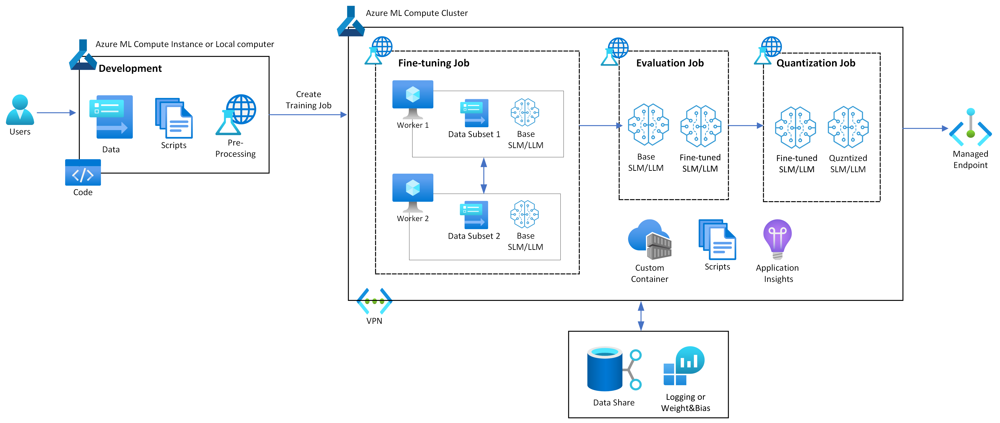

# Fine-tune/Evaluate/Quantize SLM/LLM using the torchtune on Azure ML

This hands-on walks you through fine-tuning/evaluation/quanzitation an open source SLM/LLM on Azure ML. This hands-on is suitable for the following purposes:

1. Half-day workshop or 1-day workshop
2. Hackathon starter code
3. Reference guide for SLM fine-tuning&serving PoC/Prototype

[**Introduction**](#introduction) | [**Get Started**](#get-started) | [**Blog**](coming_soon) 

## Introduction

### torchtune

torchtune is a Python library designed to simplify fine-tune SLM/LLM models using PyTorch. torchtune stands out for its simplicity and flexibility, enabling users to perform fine-tuning, evaluation, and quantization effortlessly with minimal code through YAML-based recipes. This intuitive setup allows users to define and adjust complex training configurations in a structured, readable format, reducing the need for extensive code changes. By centralizing settings into a YAML recipe, torchtune not only speeds up the experimentation process but also makes it easy to replicate or modify configurations across different models and tasks. This approach is ideal for streamlining model optimization, ensuring that fine-tuning and deployment processes are both quick and highly adaptable.

The representative features are as follows:

- **Easy Model Tuning**: Torchtune is a PyTorch-native library that simplifies the SLM fine-tuning, making it accessible to users without advanced AI expertise. 
- **Easy Application of Distributed Training**: Torchtune simplifies the setup for distributed training, allowing users to scale their models across multiple GPUs with minimal configuration. This feature significantly reduces users' trial-and-errors.
- **Simplified Model Evaluation and Quantization**: Torchtune makes model evaluation and quantization straightforward, providing built-in support to easily assess model performance and optimize models for deployment.
- **Scalability and Portability**: Torchtune is flexible enough to be used on various cloud platforms and local environments. It can be easily integrated with AzureML.

For more information about torchtune, please check [this link](https://pytorch.org/torchtune/).

### Azure ML with torchtune 



Running Torchtune on AzureML offers several advantages that streamline the GenAI workflow. Here are some key benefits of using AzureML with torchtune:

- **Scalability and Compute Power**: Azure ML provides powerful, scalable compute resources, allowing torchtune to handle multiple SLMs/LLMs across multiple GPUs or distributed clusters. This makes it ideal for efficiently managing intensive tasks like fine-tuning and quantization on large datasets.
- **Managed ML Environment**: Azure ML offers a fully managed environment, so setting up dependencies and managing versions are handled with ease. This reduces setup time for torchtune, letting users focus directly on model optimization without infrastructure concerns.
- **Model Deployment and Scaling**: Once the model is optimized with Torchtune, AzureML provides a straightforward pathway to deploy it on Azure’s cloud infrastructure, making it easy to scale applications to production with robust monitoring and scaling features.
- **Seamless Integration with Other Azure Services**: Users can leverage other Azure services, such as Azure Blob Storage for dataset storage or Azure SQL for data management. This ecosystem support enhances workflow efficiency and makes AzureML a powerful choice for torchtune-based model tuning and deployment.

## Get Started

### Requirements

Before starting, you have met the following requirements:

- [Azure ML getting started](https://github.com/Azure/azureml-examples/tree/main/tutorials): Connect to Azure ML workspace and get your <WORKSPACE_NAME>, <RESOURCE_GROUP> and <SUBSCRIPTION_ID>.
- [Azure ML CLI v2](https://learn.microsoft.com/en-us/azure/machine-learning/concept-v2?view=azureml-api-2#azure-machine-learning-cli-v2)
- ***[Compute instance - for code development]*** A low-end instance without GPU is recommended: `Standard_DS11_v2` (2 cores, 14GB RAM, 28GB storage, No GPUs).
- ***[Compute cluster - for SLM/LLM training]*** A single NVIDIA A100 GPU node (`Standard_NC24ads_A100_v4`) and a single NVIDIA V100 GPU node (`Standard_NC6s_v3`) is recommended. If you do not have a dedicated quota or are on a tight budget, choose Low-priority VM.
- [Hugging Face access token](https://huggingface.co/docs/hub/en/security-tokens): Create a Hugging Face access token to get access to the SLMs/LLMs on Hugging Face.
- [(Optional) Weights & Biases API key](https://wandb.ai/settings): Create a Weights & Biases API key to access the Weights & Biases dashboard for logging and monitoring

### Steps

1. Create your compute instance. For code development, we recommend `Standard_DS11_v2` (2 cores, 14GB RAM, 28GB storage, No GPUs).
2. Open the terminal of the CI and run:
    ```shell
    git clone https://github.com/Azure/torchtune-azureml.git
    conda activate azureml_py310_sdkv2
    pip install -r requirements.txt
    ```
3. Modify `config.yaml` with your Azure ML workspace information.
4. Choose the model to use for your desired use case.
    - [Supervisied Fine-tuning (SFT)](training_sft.ipynb)
    - [Direct Preference Optimization (DPO)](training_dpo.ipynb)
    - [Knowledge Distillation](training_kd.ipynb)

## References

- [Azure Machine Learning examples](https://github.com/Azure/azureml-examples)

```bibtex
@software{torchtune,
  title = {torchtune: PyTorch's finetuning library},
  author = {torchtune maintainers and contributors},
  url = {https//github.com/pytorch/torchtune},
  license = {BSD-3-Clause},
  month = apr,
  year = {2024}
}
```

## Contributing

This project welcomes contributions and suggestions.  Most contributions require you to agree to a
Contributor License Agreement (CLA) declaring that you have the right to, and actually do, grant us
the rights to use your contribution. For details, visit https://cla.opensource.microsoft.com.

When you submit a pull request, a CLA bot will automatically determine whether you need to provide
a CLA and decorate the PR appropriately (e.g., status check, comment). Simply follow the instructions
provided by the bot. You will only need to do this once across all repos using our CLA.

This project has adopted the [Microsoft Open Source Code of Conduct](https://opensource.microsoft.com/codeofconduct/).
For more information see the [Code of Conduct FAQ](https://opensource.microsoft.com/codeofconduct/faq/) or
contact [opencode@microsoft.com](mailto:opencode@microsoft.com) with any additional questions or comments.

## Trademarks

This project may contain trademarks or logos for projects, products, or services. Authorized use of Microsoft 
trademarks or logos is subject to and must follow 
[Microsoft's Trademark & Brand Guidelines](https://www.microsoft.com/en-us/legal/intellectualproperty/trademarks/usage/general).
Use of Microsoft trademarks or logos in modified versions of this project must not cause confusion or imply Microsoft sponsorship.
Any use of third-party trademarks or logos are subject to those third-party's policies.

## License Summary

This sample code is provided under the MIT-0 license. See the LICENSE file.